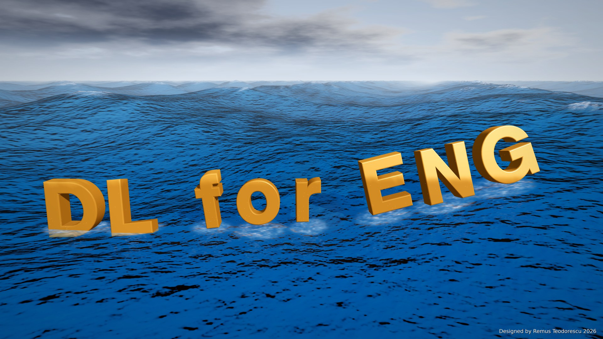

# DL for Engineers - Public Course

**Deep Learning for Engineering** - MSc course, AAU Energy, Aalborg University.
Remus Teodorescu (ret@et.aau.dk), with support from Research Assistant Noman Khan.

This repository holds the student-facing material: the lecture slides as PDF,
the lecture recordings as MP4 where available, and the exercise sets as
Colab-ready notebooks. It is generated from the course's development repository
and refreshed after every change, so it is always current.

## Notation and course policies

[`NOTATION.md`](NOTATION.md) lists every symbol used in the slides and the notebooks,
and where the textbooks write something else.
[`COURSE_POLICIES.md`](COURSE_POLICIES.md) states the eight rules the lectures and
exercises are written to.

## How to work with the exercises

Open any notebook and click the **Open in Colab** badge at its top. The first
code cell fetches the set's library files from this repository, so nothing needs
uploading. Work through the notebooks of a set in numerical order; each set ends
with a short report notebook. Running locally works just as well: clone the
repository and open the notebooks in Jupyter with the set folder as the working
directory.

## Lectures

Each lecture folder holds the slides (PDF) and, once recorded, the lecture video (MP4).
GitHub shows videos in the browser; use *Download raw file* on a video's page to keep a copy.

- `lectures/L00-course-intro/` - [slides](lectures/L00-course-intro/L0_Welcome_How_This_Course_Works.pdf)
- `lectures/L01.1-python-that-runs/` - [slides](lectures/L01.1-python-that-runs/L1.1_Python_That_Runs.pdf), [recording](lectures/L01.1-python-that-runs/L1.1_Python_That_Runs.mp4)
- `lectures/L01.2-numpy-and-arrays/` - [slides](lectures/L01.2-numpy-and-arrays/L1.2_NumPy_and_the_Shape_of_Everything.pdf), [recording](lectures/L01.2-numpy-and-arrays/L1.2_NumPy_and_the_Shape_of_Everything.mp4)
- `lectures/L02.1-scientific-python/` - [slides](lectures/L02.1-scientific-python/L2.1_Scientific_Python.pdf), [slides (v2, revised)](lectures/L02.1-scientific-python/L2.1_Scientific_Python_v2.pdf), [recording](lectures/L02.1-scientific-python/L2.1_Scientific_Python.mp4)
- `lectures/L02.2-pytorch-and-autograd/` - [slides](lectures/L02.2-pytorch-and-autograd/L2.2_PyTorch_as_an_Array_Library.pdf), [slides (v2, revised)](lectures/L02.2-pytorch-and-autograd/L2.2_PyTorch_as_an_Array_Library_v2.pdf), [recording](lectures/L02.2-pytorch-and-autograd/L2.2_PyTorch_as_an_Array_Library.mp4)
- `lectures/L03.1-what-is-ai/` - [slides](lectures/L03.1-what-is-ai/L3.1_What_is_AI.pdf), [recording](lectures/L03.1-what-is-ai/L3.1_What_is_AI.mp4)
- `lectures/L03.2-ai-application-examples/` - [slides](lectures/L03.2-ai-application-examples/L3.2_AI_Application_Examples.pdf), [recording](lectures/L03.2-ai-application-examples/L3.2_AI_Application_Examples.mp4)
- `lectures/L04.1-perceptron-to-neural-network/` - [slides](lectures/L04.1-perceptron-to-neural-network/L4.1_From_Perceptron_to_Neural_Network.pdf), [recording](lectures/L04.1-perceptron-to-neural-network/L4.1_From_Perceptron_to_Neural_Network.mp4)
- `lectures/L04.2-deep-neural-networks/` - [slides](lectures/L04.2-deep-neural-networks/L4.2_Deep_Neural_Networks.pdf), [recording](lectures/L04.2-deep-neural-networks/L4.2_Deep_Neural_Networks.mp4)
- `lectures/L05.1-convolutional-and-graph-networks/` - [slides](lectures/L05.1-convolutional-and-graph-networks/L5.1_Convolutional_and_Graph_Networks.pdf), [recording](lectures/L05.1-convolutional-and-graph-networks/L5.1_Convolutional_and_Graph_Networks.mp4)
- `lectures/L05.2-sequences-and-attention/` - [slides](lectures/L05.2-sequences-and-attention/L5.2_RNN_and_LSTM.pdf), [recording](lectures/L05.2-sequences-and-attention/L5.2_RNN_and_LSTM.mp4)
- `lectures/L06.1-loss-functions-and-gradients/` - [slides](lectures/L06.1-loss-functions-and-gradients/L6.1_Loss_Functions_and_Gradients.pdf), [recording](lectures/L06.1-loss-functions-and-gradients/L6.1_Loss_Functions_and_Gradients.mp4)
- `lectures/L06.2-post-training/` - [slides](lectures/L06.2-post-training/L6.2_Post_Training_and_Reinforcement_Learning.pdf), [recording](lectures/L06.2-post-training/L6.2_Post_Training_and_Reinforcement_Learning.mp4)
- `lectures/L07.1-fundamentals-of-pinns/` - [slides](lectures/L07.1-fundamentals-of-pinns/L7.1_Physics_Informed_Neural_Networks.pdf)
- `lectures/L07.2-fundamental-pdes/` - [slides](lectures/L07.2-fundamental-pdes/L7.2_Fundamental_PDEs.pdf)
- `lectures/L08.1-stationary-heat/` - [slides](lectures/L08.1-stationary-heat/L8.1_Stationary_Heat.pdf)
- `lectures/L08.2-dynamic-heat-transfer/` - [slides](lectures/L08.2-dynamic-heat-transfer/L8.2_Dynamic_Heat_Transfer.pdf)
- `lectures/L09.1-laminar-flow/` - [slides](lectures/L09.1-laminar-flow/L9.1_Laminar_Flow.pdf)
- `lectures/L09.2-turbulent-flow/` - [slides](lectures/L09.2-turbulent-flow/L9.2_Turbulent_Flow.pdf)
- `lectures/L10.1-ionic-diffusion/` - [slides](lectures/L10.1-ionic-diffusion/L10.1_Ionic_Diffusion_Charge_Conservation.pdf)
- `lectures/L10.2-solid-oxide-cells/` - [slides](lectures/L10.2-solid-oxide-cells/L10.2_Solid_Oxide_Cells_Optimisation.pdf)
- `lectures/L11.1-vision-based-navigation/` - [slides](lectures/L11.1-vision-based-navigation/L11.1_Vision_Based_Navigation.pdf)
- `lectures/L11.2-dynamics-energy/` - [slides](lectures/L11.2-dynamics-energy/L11.2_Dynamics_Energy_and_Efficient_Driving.pdf)
- `lectures/L12.1-power-grid-stability-estimation/` - [slides](lectures/L12.1-power-grid-stability-estimation/L12.1_Power_Grid_Stability_Estimation.pdf)
- `lectures/L12.2-power-grid-stability-prediction/` - [slides](lectures/L12.2-power-grid-stability-prediction/L12.2_Power_Grid_Stability_Prediction.pdf)

## Exercises

Each set is a folder; open a notebook in Colab with its link, or browse the set on GitHub
to see the library files and the set's README.

- `exercises/Ex01-python-fundamentals/` - [browse set](https://github.com/RemusTeodorescu/DL-for-Engineers-Public-Course/tree/main/exercises/Ex01-python-fundamentals)
  - Ex01_00_environment_check - [Colab](https://colab.research.google.com/github/RemusTeodorescu/DL-for-Engineers-Public-Course/blob/main/exercises/Ex01-python-fundamentals/Ex01_00_environment_check.ipynb)
  - Ex01_01_python_basics - [Colab](https://colab.research.google.com/github/RemusTeodorescu/DL-for-Engineers-Public-Course/blob/main/exercises/Ex01-python-fundamentals/Ex01_01_python_basics.ipynb), [light](https://colab.research.google.com/github/RemusTeodorescu/DL-for-Engineers-Public-Course/blob/main/exercises/Ex01-python-fundamentals/Ex01_01_python_basics_light.ipynb)
  - Ex01_02_numpy_and_broadcasting - [Colab](https://colab.research.google.com/github/RemusTeodorescu/DL-for-Engineers-Public-Course/blob/main/exercises/Ex01-python-fundamentals/Ex01_02_numpy_and_broadcasting.ipynb), [light](https://colab.research.google.com/github/RemusTeodorescu/DL-for-Engineers-Public-Course/blob/main/exercises/Ex01-python-fundamentals/Ex01_02_numpy_and_broadcasting_light.ipynb)
  - Ex01_03_plotting - [Colab](https://colab.research.google.com/github/RemusTeodorescu/DL-for-Engineers-Public-Course/blob/main/exercises/Ex01-python-fundamentals/Ex01_03_plotting.ipynb), [light](https://colab.research.google.com/github/RemusTeodorescu/DL-for-Engineers-Public-Course/blob/main/exercises/Ex01-python-fundamentals/Ex01_03_plotting_light.ipynb)
- `exercises/Ex02-pytorch-and-autograd/` - [browse set](https://github.com/RemusTeodorescu/DL-for-Engineers-Public-Course/tree/main/exercises/Ex02-pytorch-and-autograd)
  - Ex02_00_environment_check - [Colab](https://colab.research.google.com/github/RemusTeodorescu/DL-for-Engineers-Public-Course/blob/main/exercises/Ex02-pytorch-and-autograd/Ex02_00_environment_check.ipynb)
  - Ex02_01_tensors - [Colab](https://colab.research.google.com/github/RemusTeodorescu/DL-for-Engineers-Public-Course/blob/main/exercises/Ex02-pytorch-and-autograd/Ex02_01_tensors.ipynb), [light](https://colab.research.google.com/github/RemusTeodorescu/DL-for-Engineers-Public-Course/blob/main/exercises/Ex02-pytorch-and-autograd/Ex02_01_tensors_light.ipynb)
  - Ex02_02_autograd_by_hand - [Colab](https://colab.research.google.com/github/RemusTeodorescu/DL-for-Engineers-Public-Course/blob/main/exercises/Ex02-pytorch-and-autograd/Ex02_02_autograd_by_hand.ipynb), [light](https://colab.research.google.com/github/RemusTeodorescu/DL-for-Engineers-Public-Course/blob/main/exercises/Ex02-pytorch-and-autograd/Ex02_02_autograd_by_hand_light.ipynb)
  - Ex02_03_training_loop - [Colab](https://colab.research.google.com/github/RemusTeodorescu/DL-for-Engineers-Public-Course/blob/main/exercises/Ex02-pytorch-and-autograd/Ex02_03_training_loop.ipynb), [light](https://colab.research.google.com/github/RemusTeodorescu/DL-for-Engineers-Public-Course/blob/main/exercises/Ex02-pytorch-and-autograd/Ex02_03_training_loop_light.ipynb)
- `exercises/Ex03-first-model/` - [browse set](https://github.com/RemusTeodorescu/DL-for-Engineers-Public-Course/tree/main/exercises/Ex03-first-model)
  - Ex03_vibrating_mass - [Colab](https://colab.research.google.com/github/RemusTeodorescu/DL-for-Engineers-Public-Course/blob/main/exercises/Ex03-first-model/Ex03_vibrating_mass.ipynb)
- `exercises/Ex04-perceptron-to-mlp/` - [browse set](https://github.com/RemusTeodorescu/DL-for-Engineers-Public-Course/tree/main/exercises/Ex04-perceptron-to-mlp)
  - Ex04_00_environment_check - [Colab](https://colab.research.google.com/github/RemusTeodorescu/DL-for-Engineers-Public-Course/blob/main/exercises/Ex04-perceptron-to-mlp/Ex04_00_environment_check.ipynb)
  - Ex04_01_perceptron_and_xor - [Colab](https://colab.research.google.com/github/RemusTeodorescu/DL-for-Engineers-Public-Course/blob/main/exercises/Ex04-perceptron-to-mlp/Ex04_01_perceptron_and_xor.ipynb), [light](https://colab.research.google.com/github/RemusTeodorescu/DL-for-Engineers-Public-Course/blob/main/exercises/Ex04-perceptron-to-mlp/Ex04_01_perceptron_and_xor_light.ipynb)
  - Ex04_02_pytorch_mlp - [Colab](https://colab.research.google.com/github/RemusTeodorescu/DL-for-Engineers-Public-Course/blob/main/exercises/Ex04-perceptron-to-mlp/Ex04_02_pytorch_mlp.ipynb), [light](https://colab.research.google.com/github/RemusTeodorescu/DL-for-Engineers-Public-Course/blob/main/exercises/Ex04-perceptron-to-mlp/Ex04_02_pytorch_mlp_light.ipynb)
  - Ex04_03_counting_kinks - [Colab](https://colab.research.google.com/github/RemusTeodorescu/DL-for-Engineers-Public-Course/blob/main/exercises/Ex04-perceptron-to-mlp/Ex04_03_counting_kinks.ipynb), [light](https://colab.research.google.com/github/RemusTeodorescu/DL-for-Engineers-Public-Course/blob/main/exercises/Ex04-perceptron-to-mlp/Ex04_03_counting_kinks_light.ipynb)
  - Ex04_04_depth_vs_width - [Colab](https://colab.research.google.com/github/RemusTeodorescu/DL-for-Engineers-Public-Course/blob/main/exercises/Ex04-perceptron-to-mlp/Ex04_04_depth_vs_width.ipynb), [light](https://colab.research.google.com/github/RemusTeodorescu/DL-for-Engineers-Public-Course/blob/main/exercises/Ex04-perceptron-to-mlp/Ex04_04_depth_vs_width_light.ipynb)
  - Ex04_05_overfit_then_regularise - [Colab](https://colab.research.google.com/github/RemusTeodorescu/DL-for-Engineers-Public-Course/blob/main/exercises/Ex04-perceptron-to-mlp/Ex04_05_overfit_then_regularise.ipynb), [light](https://colab.research.google.com/github/RemusTeodorescu/DL-for-Engineers-Public-Course/blob/main/exercises/Ex04-perceptron-to-mlp/Ex04_05_overfit_then_regularise_light.ipynb)
  - Ex04_06_report - [Colab](https://colab.research.google.com/github/RemusTeodorescu/DL-for-Engineers-Public-Course/blob/main/exercises/Ex04-perceptron-to-mlp/Ex04_06_report.ipynb)
- `exercises/Ex05-cnn-and-gnn/` - [browse set](https://github.com/RemusTeodorescu/DL-for-Engineers-Public-Course/tree/main/exercises/Ex05-cnn-and-gnn)
  - Ex05_00_environment_check - [Colab](https://colab.research.google.com/github/RemusTeodorescu/DL-for-Engineers-Public-Course/blob/main/exercises/Ex05-cnn-and-gnn/Ex05_00_environment_check.ipynb)
  - Ex05_01_cnn_image_classification - [Colab](https://colab.research.google.com/github/RemusTeodorescu/DL-for-Engineers-Public-Course/blob/main/exercises/Ex05-cnn-and-gnn/Ex05_01_cnn_image_classification.ipynb), [light](https://colab.research.google.com/github/RemusTeodorescu/DL-for-Engineers-Public-Course/blob/main/exercises/Ex05-cnn-and-gnn/Ex05_01_cnn_image_classification_light.ipynb)
  - Ex05_02_graph_basics - [Colab](https://colab.research.google.com/github/RemusTeodorescu/DL-for-Engineers-Public-Course/blob/main/exercises/Ex05-cnn-and-gnn/Ex05_02_graph_basics.ipynb), [light](https://colab.research.google.com/github/RemusTeodorescu/DL-for-Engineers-Public-Course/blob/main/exercises/Ex05-cnn-and-gnn/Ex05_02_graph_basics_light.ipynb)
  - Ex05_03_gnn_six_bus_network - [Colab](https://colab.research.google.com/github/RemusTeodorescu/DL-for-Engineers-Public-Course/blob/main/exercises/Ex05-cnn-and-gnn/Ex05_03_gnn_six_bus_network.ipynb), [light](https://colab.research.google.com/github/RemusTeodorescu/DL-for-Engineers-Public-Course/blob/main/exercises/Ex05-cnn-and-gnn/Ex05_03_gnn_six_bus_network_light.ipynb)
  - Ex05_04_sequence_model - [Colab](https://colab.research.google.com/github/RemusTeodorescu/DL-for-Engineers-Public-Course/blob/main/exercises/Ex05-cnn-and-gnn/Ex05_04_sequence_model.ipynb), [light](https://colab.research.google.com/github/RemusTeodorescu/DL-for-Engineers-Public-Course/blob/main/exercises/Ex05-cnn-and-gnn/Ex05_04_sequence_model_light.ipynb)
  - Ex05_05_report - [Colab](https://colab.research.google.com/github/RemusTeodorescu/DL-for-Engineers-Public-Course/blob/main/exercises/Ex05-cnn-and-gnn/Ex05_05_report.ipynb)
- `exercises/Ex06-training-lab/` - [browse set](https://github.com/RemusTeodorescu/DL-for-Engineers-Public-Course/tree/main/exercises/Ex06-training-lab)
  - Ex06_00_environment_check - [Colab](https://colab.research.google.com/github/RemusTeodorescu/DL-for-Engineers-Public-Course/blob/main/exercises/Ex06-training-lab/Ex06_00_environment_check.ipynb)
  - Ex06_01_loss_functions - [Colab](https://colab.research.google.com/github/RemusTeodorescu/DL-for-Engineers-Public-Course/blob/main/exercises/Ex06-training-lab/Ex06_01_loss_functions.ipynb), [light](https://colab.research.google.com/github/RemusTeodorescu/DL-for-Engineers-Public-Course/blob/main/exercises/Ex06-training-lab/Ex06_01_loss_functions_light.ipynb)
  - Ex06_02_optimiser_comparison - [Colab](https://colab.research.google.com/github/RemusTeodorescu/DL-for-Engineers-Public-Course/blob/main/exercises/Ex06-training-lab/Ex06_02_optimiser_comparison.ipynb), [light](https://colab.research.google.com/github/RemusTeodorescu/DL-for-Engineers-Public-Course/blob/main/exercises/Ex06-training-lab/Ex06_02_optimiser_comparison_light.ipynb)
  - Ex06_03_transfer_and_fine_tuning - [Colab](https://colab.research.google.com/github/RemusTeodorescu/DL-for-Engineers-Public-Course/blob/main/exercises/Ex06-training-lab/Ex06_03_transfer_and_fine_tuning.ipynb), [light](https://colab.research.google.com/github/RemusTeodorescu/DL-for-Engineers-Public-Course/blob/main/exercises/Ex06-training-lab/Ex06_03_transfer_and_fine_tuning_light.ipynb)
  - Ex06_04_battery_arbitrage - [Colab](https://colab.research.google.com/github/RemusTeodorescu/DL-for-Engineers-Public-Course/blob/main/exercises/Ex06-training-lab/Ex06_04_battery_arbitrage.ipynb), [light](https://colab.research.google.com/github/RemusTeodorescu/DL-for-Engineers-Public-Course/blob/main/exercises/Ex06-training-lab/Ex06_04_battery_arbitrage_light.ipynb)
  - Ex06_05_report - [Colab](https://colab.research.google.com/github/RemusTeodorescu/DL-for-Engineers-Public-Course/blob/main/exercises/Ex06-training-lab/Ex06_05_report.ipynb)
- `exercises/Ex07.1-poisson/` - [browse set](https://github.com/RemusTeodorescu/DL-for-Engineers-Public-Course/tree/main/exercises/Ex07.1-poisson)
  - Ex07.1_pinn_thermal_prediction - [Colab](https://colab.research.google.com/github/RemusTeodorescu/DL-for-Engineers-Public-Course/blob/main/exercises/Ex07.1-poisson/Ex07.1_pinn_thermal_prediction.ipynb), [light](https://colab.research.google.com/github/RemusTeodorescu/DL-for-Engineers-Public-Course/blob/main/exercises/Ex07.1-poisson/Ex07.1_pinn_thermal_prediction_light.ipynb)
- `exercises/Ex07.2-heat-and-wave/` - [browse set](https://github.com/RemusTeodorescu/DL-for-Engineers-Public-Course/tree/main/exercises/Ex07.2-heat-and-wave)
  - Ex07.2_1_die_pulse - [Colab](https://colab.research.google.com/github/RemusTeodorescu/DL-for-Engineers-Public-Course/blob/main/exercises/Ex07.2-heat-and-wave/Ex07.2_1_die_pulse.ipynb), [light](https://colab.research.google.com/github/RemusTeodorescu/DL-for-Engineers-Public-Course/blob/main/exercises/Ex07.2-heat-and-wave/Ex07.2_1_die_pulse_light.ipynb)
  - Ex07.2_2_slot_runaway - [Colab](https://colab.research.google.com/github/RemusTeodorescu/DL-for-Engineers-Public-Course/blob/main/exercises/Ex07.2-heat-and-wave/Ex07.2_2_slot_runaway.ipynb), [light](https://colab.research.google.com/github/RemusTeodorescu/DL-for-Engineers-Public-Course/blob/main/exercises/Ex07.2-heat-and-wave/Ex07.2_2_slot_runaway_light.ipynb)
  - Ex07.2_3_panel_strike - [Colab](https://colab.research.google.com/github/RemusTeodorescu/DL-for-Engineers-Public-Course/blob/main/exercises/Ex07.2-heat-and-wave/Ex07.2_3_panel_strike.ipynb), [light](https://colab.research.google.com/github/RemusTeodorescu/DL-for-Engineers-Public-Course/blob/main/exercises/Ex07.2-heat-and-wave/Ex07.2_3_panel_strike_light.ipynb)
- `exercises/Ex08.1-stationary-heat/` - [browse set](https://github.com/RemusTeodorescu/DL-for-Engineers-Public-Course/tree/main/exercises/Ex08.1-stationary-heat)
  - Ex08.1_heatsink_new - [Colab](https://colab.research.google.com/github/RemusTeodorescu/DL-for-Engineers-Public-Course/blob/main/exercises/Ex08.1-stationary-heat/Ex08.1_heatsink_new.ipynb), [light](https://colab.research.google.com/github/RemusTeodorescu/DL-for-Engineers-Public-Course/blob/main/exercises/Ex08.1-stationary-heat/Ex08.1_heatsink_new_light.ipynb)
  - Ex08.1_pinn_plate_with_channel - [Colab](https://colab.research.google.com/github/RemusTeodorescu/DL-for-Engineers-Public-Course/blob/main/exercises/Ex08.1-stationary-heat/Ex08.1_pinn_plate_with_channel.ipynb), [light](https://colab.research.google.com/github/RemusTeodorescu/DL-for-Engineers-Public-Course/blob/main/exercises/Ex08.1-stationary-heat/Ex08.1_pinn_plate_with_channel_light.ipynb)
- `exercises/Ex08.2-transient-heat/` - [browse set](https://github.com/RemusTeodorescu/DL-for-Engineers-Public-Course/tree/main/exercises/Ex08.2-transient-heat)
  - Ex08.2_heatsink_new - [Colab](https://colab.research.google.com/github/RemusTeodorescu/DL-for-Engineers-Public-Course/blob/main/exercises/Ex08.2-transient-heat/Ex08.2_heatsink_new.ipynb), [light](https://colab.research.google.com/github/RemusTeodorescu/DL-for-Engineers-Public-Course/blob/main/exercises/Ex08.2-transient-heat/Ex08.2_heatsink_new_light.ipynb)
  - Ex08.2_pinn_plate_switched_on - [Colab](https://colab.research.google.com/github/RemusTeodorescu/DL-for-Engineers-Public-Course/blob/main/exercises/Ex08.2-transient-heat/Ex08.2_pinn_plate_switched_on.ipynb), [light](https://colab.research.google.com/github/RemusTeodorescu/DL-for-Engineers-Public-Course/blob/main/exercises/Ex08.2-transient-heat/Ex08.2_pinn_plate_switched_on_light.ipynb)
- `exercises/Ex09.1-burgers-2d/` - [browse set](https://github.com/RemusTeodorescu/DL-for-Engineers-Public-Course/tree/main/exercises/Ex09.1-burgers-2d)
  - Ex09.1_pinn_burgers_front - [Colab](https://colab.research.google.com/github/RemusTeodorescu/DL-for-Engineers-Public-Course/blob/main/exercises/Ex09.1-burgers-2d/Ex09.1_pinn_burgers_front.ipynb), [light](https://colab.research.google.com/github/RemusTeodorescu/DL-for-Engineers-Public-Course/blob/main/exercises/Ex09.1-burgers-2d/Ex09.1_pinn_burgers_front_light.ipynb)
- `exercises/Ex09.2-channel-flow/` - [browse set](https://github.com/RemusTeodorescu/DL-for-Engineers-Public-Course/tree/main/exercises/Ex09.2-channel-flow)
  - Ex09.2_pinn_flow_past_tube - [Colab](https://colab.research.google.com/github/RemusTeodorescu/DL-for-Engineers-Public-Course/blob/main/exercises/Ex09.2-channel-flow/Ex09.2_pinn_flow_past_tube.ipynb), [light](https://colab.research.google.com/github/RemusTeodorescu/DL-for-Engineers-Public-Course/blob/main/exercises/Ex09.2-channel-flow/Ex09.2_pinn_flow_past_tube_light.ipynb)
- `exercises/Ex10.1-spm-and-thermal/` - [browse set](https://github.com/RemusTeodorescu/DL-for-Engineers-Public-Course/tree/main/exercises/Ex10.1-spm-and-thermal)
  - Ex10.1_pinn_particle_diffusion - [Colab](https://colab.research.google.com/github/RemusTeodorescu/DL-for-Engineers-Public-Course/blob/main/exercises/Ex10.1-spm-and-thermal/Ex10.1_pinn_particle_diffusion.ipynb), [light](https://colab.research.google.com/github/RemusTeodorescu/DL-for-Engineers-Public-Course/blob/main/exercises/Ex10.1-spm-and-thermal/Ex10.1_pinn_particle_diffusion_light.ipynb)
- `exercises/Ex10.2-solid-oxide-cell/` - [browse set](https://github.com/RemusTeodorescu/DL-for-Engineers-Public-Course/tree/main/exercises/Ex10.2-solid-oxide-cell)
  - Ex10.2_pinn_steam_channel - [Colab](https://colab.research.google.com/github/RemusTeodorescu/DL-for-Engineers-Public-Course/blob/main/exercises/Ex10.2-solid-oxide-cell/Ex10.2_pinn_steam_channel.ipynb), [light](https://colab.research.google.com/github/RemusTeodorescu/DL-for-Engineers-Public-Course/blob/main/exercises/Ex10.2-solid-oxide-cell/Ex10.2_pinn_steam_channel_light.ipynb)
- `exercises/Ex11.1-camera-navigation/` - [browse set](https://github.com/RemusTeodorescu/DL-for-Engineers-Public-Course/tree/main/exercises/Ex11.1-camera-navigation)
  - Ex11.1_cnn_steering_from_a_frame - [Colab](https://colab.research.google.com/github/RemusTeodorescu/DL-for-Engineers-Public-Course/blob/main/exercises/Ex11.1-camera-navigation/Ex11.1_cnn_steering_from_a_frame.ipynb), [light](https://colab.research.google.com/github/RemusTeodorescu/DL-for-Engineers-Public-Course/blob/main/exercises/Ex11.1-camera-navigation/Ex11.1_cnn_steering_from_a_frame_light.ipynb)
  - Ex11.1_on_the_car - [Colab](https://colab.research.google.com/github/RemusTeodorescu/DL-for-Engineers-Public-Course/blob/main/exercises/Ex11.1-camera-navigation/Ex11.1_on_the_car.ipynb)
- `exercises/Ex11.2-energy-optimization/` - [browse set](https://github.com/RemusTeodorescu/DL-for-Engineers-Public-Course/tree/main/exercises/Ex11.2-energy-optimization)
  - Ex11.2_on_the_car - [Colab](https://colab.research.google.com/github/RemusTeodorescu/DL-for-Engineers-Public-Course/blob/main/exercises/Ex11.2-energy-optimization/Ex11.2_on_the_car.ipynb)
  - Ex11.2_pinn_cheapest_lap - [Colab](https://colab.research.google.com/github/RemusTeodorescu/DL-for-Engineers-Public-Course/blob/main/exercises/Ex11.2-energy-optimization/Ex11.2_pinn_cheapest_lap.ipynb), [light](https://colab.research.google.com/github/RemusTeodorescu/DL-for-Engineers-Public-Course/blob/main/exercises/Ex11.2-energy-optimization/Ex11.2_pinn_cheapest_lap_light.ipynb)
- `exercises/Ex12.1-power-grid-stability-estimation/` - [browse set](https://github.com/RemusTeodorescu/DL-for-Engineers-Public-Course/tree/main/exercises/Ex12.1-power-grid-stability-estimation)
  - Ex12.1_pinn_grid_state - [Colab](https://colab.research.google.com/github/RemusTeodorescu/DL-for-Engineers-Public-Course/blob/main/exercises/Ex12.1-power-grid-stability-estimation/Ex12.1_pinn_grid_state.ipynb), [light](https://colab.research.google.com/github/RemusTeodorescu/DL-for-Engineers-Public-Course/blob/main/exercises/Ex12.1-power-grid-stability-estimation/Ex12.1_pinn_grid_state_light.ipynb)
- `exercises/Ex12.2-power-grid-stability-prediction/` - [browse set](https://github.com/RemusTeodorescu/DL-for-Engineers-Public-Course/tree/main/exercises/Ex12.2-power-grid-stability-prediction)
  - Ex12.2_gnn_contingency_screening - [Colab](https://colab.research.google.com/github/RemusTeodorescu/DL-for-Engineers-Public-Course/blob/main/exercises/Ex12.2-power-grid-stability-prediction/Ex12.2_gnn_contingency_screening.ipynb), [light](https://colab.research.google.com/github/RemusTeodorescu/DL-for-Engineers-Public-Course/blob/main/exercises/Ex12.2-power-grid-stability-prediction/Ex12.2_gnn_contingency_screening_light.ipynb)
  - Ex12.2_on_the_board - [Colab](https://colab.research.google.com/github/RemusTeodorescu/DL-for-Engineers-Public-Course/blob/main/exercises/Ex12.2-power-grid-stability-prediction/Ex12.2_on_the_board.ipynb)
  - Ex12.2_supplement_andes_comparison - [Colab](https://colab.research.google.com/github/RemusTeodorescu/DL-for-Engineers-Public-Course/blob/main/exercises/Ex12.2-power-grid-stability-prediction/Ex12.2_supplement_andes_comparison.ipynb)

## Licence

(c) 2026 Remus Teodorescu, Aalborg University. A licence will be added shortly;
until then the material is shared for the course's students.

Synced from the development repository; 27 lecture PDFs, 12 recordings and 18 exercise sets.
